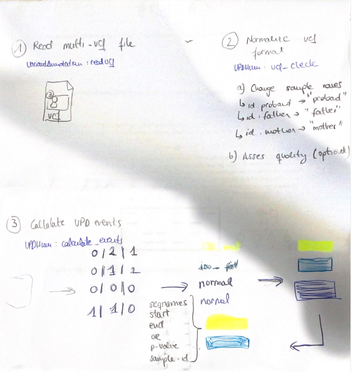

```{r setup, include=FALSE}
knitr::opts_chunk$set(
  comment = "",
  warning = FALSE,
  message = FALSE,
  cache = FALSE
)
```

# Introduction

## Background

Uniparental disomy (UPD) is a rare genetic condition where an individual inherits both copies of a chromosome from one parent, as opposed to the typical inheritance of one copy from each parent. The extent of its contribution as a causative factor in rare genetic diseases remains largely unexplored. UPDs can lead to disease either by inheriting a carrier pathogenic mutation as homozygous from a carrier parent or by causing errors in genetic imprinting. Nevertheless, there are currently no standardized methods available for the detection and characterization of these events.

We have developed the UPDhmm R/Bioconductor package, offering a comprehensive tool for the detection, classification, and determination of the location of uniparental disomy events. The complete UPDhmm user's guide can be found in this vignette.

## Methodology

The UPDhmm package utilizes a Hidden Markov Model (HMM) to identify regions considered as Uniparental disomy events by analyzing High-Throughput Sequencing (HTS) data from a trio of samples (mother, father, and proband). The HMM is constructed based on differences in allelic frequencies among possible states (isodisomy, heterodisomy, or normal). Using the Viterbi algorithm, the package calculates the likelihood of each state given a genotype sequence. In essence, by analyzing the inheritance pattern within the trio, the UPDhmm package infers whether there is a Uniparental Disomy (UPD) event in the proband or not.


```{r implementation, echo=FALSE, fig.cap= "UPDhmm package workflow", out.width = '90%', fig.align='center'}
#
```

# Setup

## Installing the packages

```{r, eval=FALSE}
if (!requireNamespace("BiocManager", quietly = TRUE)) {
  install.packages("BiocManager")
}

BiocManager::install("UPDhmm")
```

## Loading libraries

```{r, message = FALSE}
library(UPDhmm)
```

## Quick start


The UPDhmm package requires a multisample VCF (Variant Call Format) file as input, which may need preprocessing to meet specific requirements:

- The VCF file must exclusively contain biallelic sites.
- Accepted GT (Genotype) formats are limited to: 0/1, 1/0, 0/1, 1/1, or 0|1, 1|0, 0|1, and 1|1.

Ensuring compliance with these requirements is essential for the accurate functioning of the package.

# Datasets {#datasets}

The UPDhmm package includes one example dataset, adapted from [GIB (genome in a bottle) database](https://www.nist.gov/programs-projects/genome-bottle). This dataset serves as a practical illustration and can be utilized for testing and familiarizing users with the functionality of the package.

# Preprocessing

After reading the VCF file, the `vcf_check()` function is employed for preprocessing the input data. This function facilitates reading the VCF in the suitable format for the UPDhmm package. 


```{r echo=TRUE}
library(UPDhmm)
library(VariantAnnotation)
file <- system.file(package = "UPDhmm", "extdata", "test_het_mat.vcf.gz")
vcf <- readVcf(file)
def_vcf <- vcf_check(vcf,
  proband = "NA19675", mother = "NA19678",father = "NA19679")

```

# Uniparental disomy detection


The principal function of the `UPDhmm` package, `calculate_events()`, is the central function for identifying Uniparental Disomy (UPD) events. It takes the output from the previous `vcf_check()` function and systematically analyzes genomic data, splitting the VCF into chromosomes, applying the Viterbi algorithm,


The core functionality of the `UPDhmm` package is encapsulated in the `calculate_events()` functiom which encompasses a serie of subprocesses for identifying Uniparental Disomies (UPDs). The main steps involved are:

(1) Split vcf into chromosomes
(2) Apply Viterbi algorithm to every chromosome
(3) Transform the inferred hidden states to a coordinates data.frame
(4) Create blocks of contiguous variants with the same state
(5) Calculate the statistics parameters (OR and p-value).

This function requires the object generated by the `vcf_check()` function.


```{r echo=TRUE}
results_blocks <- calculate_events(def_vcf)
```

## Results description

The `calculate_events` function returns a data frame containing all detected events in the provided trio. 
If no events are found, it will print "No events found."

| Column name         | Description                                        |
|---------------------|----------------------------------------------------|
| `sample_id`         | Sample proband ID                                  |
| `seqnames`          | Chromosome                                         | 
|  `start`            | Start position of the block                        |
|  `end`              | End position of the block                          |
| `n_snps`            | Number of variants within the event                |
| `group`             | Predicted state                                    |
| `log_OR`            | log likelihood ratio                               |
| `p_value`           | p-value                                            |

## Results Visualization
To visualize the results, the `karyoploteR` package can be employed. 
Here, a custom function is provided for easy implementation with the output results.

```{r echo=TRUE}
library(karyoploteR)
plot_kp_upd <- function(results_blocks) {
  results_blocks$seqnames <- paste0("chr", results_blocks$seqnames)

  het_fat <- toGRanges(subset(results_blocks, group == "het_fat")[, c("seqnames", "start", "end")])
  het_mat <- toGRanges(subset(results_blocks, group == "het_mat")[, c("seqnames", "start", "end")])
  iso_fat <- toGRanges(subset(results_blocks, group == "iso_fat")[, c("seqnames", "start", "end")])
  iso_mat <- toGRanges(subset(results_blocks, group == "iso_mat")[, c("seqnames", "start", "end")])

  kp <- plotKaryotype(genome = "hg19")
  kpPlotRegions(kp, het_fat, col = "#AAF593")
  kpPlotRegions(kp, het_mat, col = "#FFB6C1")
  kpPlotRegions(kp, iso_fat, col = "#A6E5FC")
  kpPlotRegions(kp, iso_mat, col = "#E9B864")

  colors <- c("#AAF593", "#FFB6C1", "#A6E5FC", "#E9B864", "#676779")
  legend("topright", legend = c("Het_Fat", "Het_Mat", "Iso_Fat", "Iso_Mat"), fill = colors)
}

plot_kp_upd(results_blocks)


```
# Session Info

```{r}
sessionInfo()
```

# References

